# ColabFold Tutorial

This tutorial introduces how to use ColabFold to predict protein structures with AlphaFold2, compare alternative multiple sequence alignment (MSA) strategies, and interpret model confidence carefully. You will work through monomer predictions first, then explore how custom MSAs and multimer predictions can change the results. By the end, you should be able to run ColabFold independently and judge when a prediction is biologically meaningful versus potentially misleading.

---

## Exercise 1: Basic AlphaFold2 prediction

In this first exercise, you will submit a single protein sequence to ColabFold and generate an initial structure prediction. This gives you a reference model and lets you inspect the standard outputs produced by the notebook.

**Target:** PIGU subunit of the human GPIT protein (UniProt ID: [Q9H490](https://www.uniprot.org/uniprotkb/Q9H490))

**Input sequence:** The FASTA file can be found in the [Data](data.md) section (Exercise 1), or you can copy it directly from UniProt.

1. Access ColabFold via [GitHub - sokrypton/ColabFold](https://github.com/sokrypton/ColabFold) and click **AlphaFold2_mmseqs2**.

    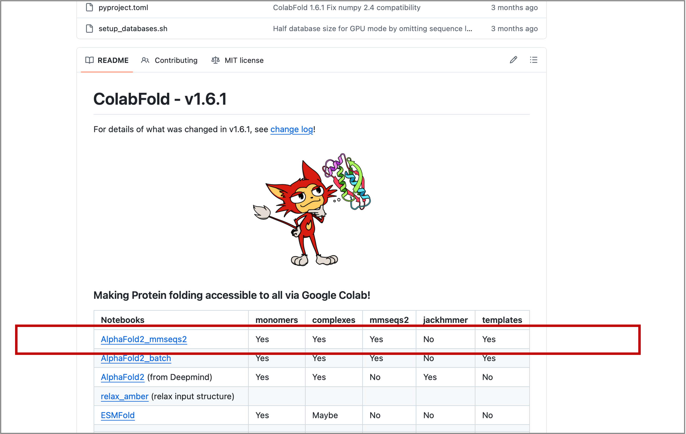

2. Replace the default `query_sequence` with the PIGU sequence and rename the `jobname` (see Figure 1).
3. Run the next cell **install_dependencies**. It does not contain any modifiable parameters.
4. Continue to **MSA options**. This cell controls the homology search for the input. Keep it at its default values and run the cell.
5. The **Advanced Settings** cell allows for controlling the type of prediction model, recycling, MSA sampling and randomization. We will cover them later in this tutorial. For this exercise use its pre-loaded default setting.
6. Run the **Run prediction** cell to start the prediction process (~17 min). The five computed protein models will be ranked by their predicted local distance difference test (pLDDT) score.
7. Run **Display 3D structure**. Select the model to be displayed by its rank using `rank_num`, then run the cell. This cell also allows for adjusting the colors and chain display.
8. Run the **Plots** cell to produce the predicted aligned error (PAE), sequence coverage and pLDDT plots.
9. Save the results as a compressed zip file by running the **Package and download results** cell.

!!! tip
    Alternatively, you can set all the parameters and then run all cells. Go to **Runtime → Run all**. Click "Run anyway" in the pop-up window to proceed.

    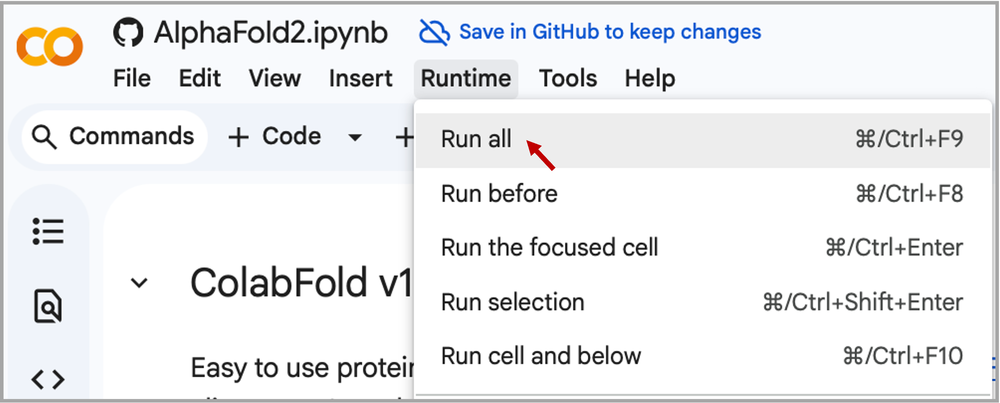

!!! warning
    Google Colab typically allows only one active notebook at a time. Terminate any other Colab sessions before starting ColabFold. If you continue to have problems, or if Colab disconnects during the prediction, go to the "Runtime" menu, select "Disconnect and delete runtime," then click "Run all" to restart the process.

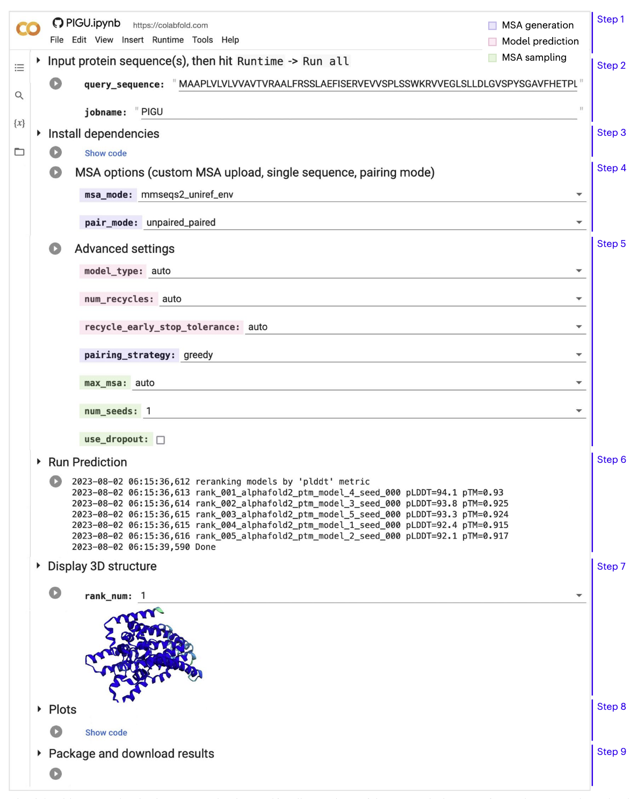

!!! question "Questions to consider"
    - Look at the sequence coverage plot. What can you say about the MSA quality?
    - Examine and compare all five models. Is there agreement among them?
    - Which regions are predicted with high confidence? Are there low-confidence loops or termini?
    - Is there good coverage for these regions in the sequence coverage plot?

---

## Exercise 2: Default versus custom MSA

In this exercise, you will compare the default ColabFold MSA against a custom MSA that you provide yourself. The goal is to understand how sequence depth and sequence diversity can affect structural confidence and model quality.

**Target:** Predicted viral protein (UniProt ID: [G9B1X0](https://www.uniprot.org/uniprotkb/G9B1X0))

**Input sequence:** The FASTA file can be found in the [Data](data.md) section (Exercise 2), or you can copy it directly from UniProt.

1. Run ColabFold with default parameters as described in Exercise 1. Evaluate the resulting models, confidence metrics, and plots showing sequence coverage and identity in the MSA. Save the results.

2. Prepare your own MSA in A3M format with [HHblits Toolkit server](https://toolkit.tuebingen.mpg.de/tools/hhblits):

    **Step 1:** Paste the input sequence.

    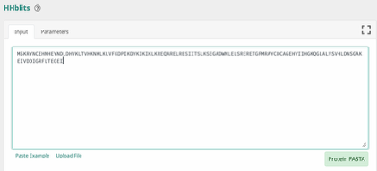{ width="80%" }

    **Step 2:** Set the parameters as shown below and click **Submit**.

    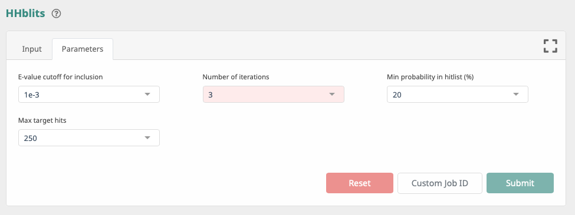{ width="80%" }

    **Step 3:** Download the resulting MSA in A3M format.

    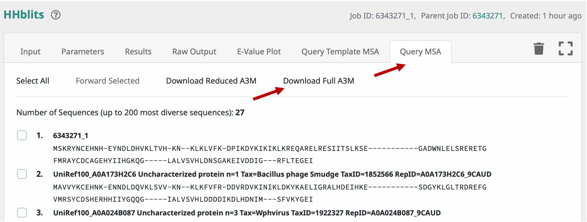{ width="80%" }

    **Step 4:** Open the downloaded file in a text editor and delete the first line containing the format marker `#A3M#`, as shown below, otherwise ColabFold will return an error.

    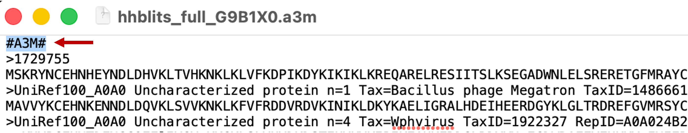

    !!! warning "Troubleshooting"
        If your MSA source adds extra headers or nonstandard formatting, remove anything that may interfere with parsing before uploading.

3. Rerun ColabFold with the custom MSA: select `custom` for `msa_mode`, then upload the downloaded A3M file.

    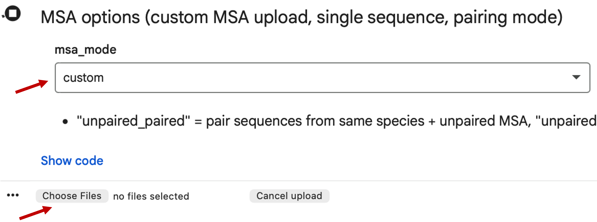

4. Evaluate the resulting models, confidence metrics, and plots with sequence coverage and identity in the MSA.

    !!! question "Questions to consider"
        - What is the difference between the ColabFold default MSA and the custom HHblits MSA used in this exercise?
        - How do MSA depth, diversity, and coverage influence prediction confidence for this protein?

5. Save the results.
6. Open the best-ranked models in Mol* and compare the structure generated with the ColabFold default MSA to the structure generated with the HHblits MSA. Superpose the models with TM-align and color them by pLDDT.
7. Finally, check the [AlphaFold Protein Structure Database (AFDB)](https://alphafold.ebi.ac.uk/) entry for this protein and identify which MSA strategy produced the model most similar to the one shown in the AFDB entry.

---

## Exercise 3: Multimer prediction

In this exercise, you will examine a protein complex prediction. The aim is not only to run ColabFold multimer mode, but also to evaluate whether the predicted interface is likely to be real.

### 3.1 "Good example" for complex prediction

**Target:** Transcription elongation factor Eaf N-terminal domain-containing protein from *Dictyostelium discoideum* (UniProt ID: [Q55DI5](https://www.uniprot.org/uniprotkb/Q55DI5))

**Input sequences:** The FASTA file can be found in the [Data](data.md) section (Exercise 3.1).

1. Run ColabFold to model the target protein as a **homodimer** using the default parameters (~10 min). Use `:` to specify inter-protein chainbreaks for modeling complexes. For example `PI...SK:PI...SK` for a homodimer.

    !!! note
        You do not need to manually select AlphaFold-Multimer. The best complex prediction model (`alphafold2_multimer_v3`) is selected automatically when the `input_sequence` field contains more than one sequence separated by `:`.

2. While the complex prediction is running, open the AFDB and retrieve the monomer prediction for Q55DI5. Evaluate the model and its confidence scores. What can you say about them?
3. Download the mmCIF file for Q55DI5 from AFDB.

    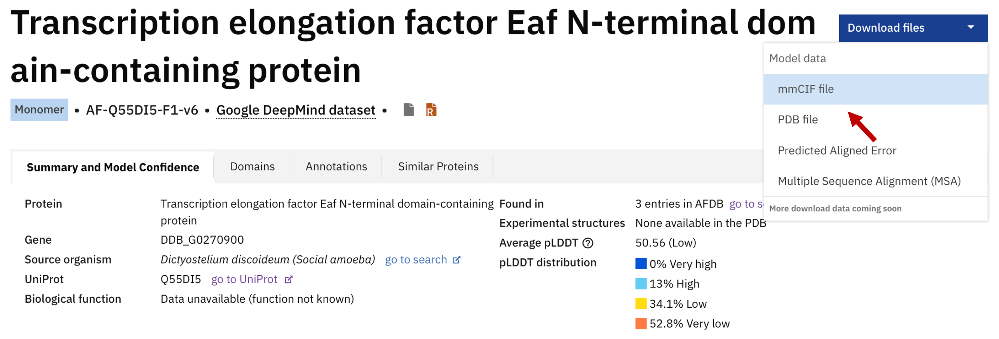

4. Once the ColabFold job finishes, evaluate the homodimer prediction and download the results.
5. Open Mol* and upload both the best ColabFold homodimer prediction and the AFDB monomer model. Superpose the monomer onto one chain of the complex. What do you observe?

    !!! question "Questions to consider"
        - What does the superposition tell you about the difference between the monomeric and dimeric folds?
        - Why does the monomer appear disordered compared to the homodimer?
        - But what is the native fold for Q55DI5? And what would you do if you don't know in which oligomeric state you should model the target protein?

6. Go to [SWISS-MODEL Repository](https://swissmodel.expasy.org/repository) and paste `Q55DI5` in the search field.

    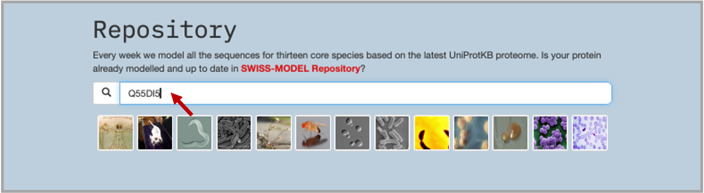

7. The results of the search show: (1) the best template found in PDB100 through a sequence search, which was used to build the SWISS-MODEL model (3); SWISS-MODEL also shows good hits found in AFDB. Chain O was the template from the found complex **PDB ID: 7OKX** (4).

    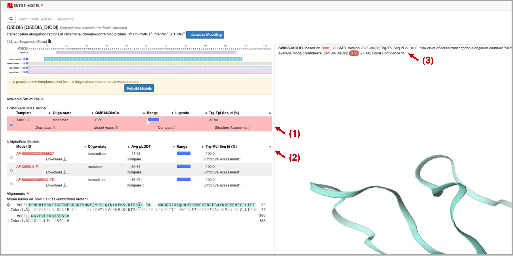

8. Now superpose in Mol\* the found template chain with the modeled homodimer. What can you say about that?

---

### 3.2 "Bad example" for complex prediction

This exercise emphasises that AF2, like AF3, does not know the stoichiometry of the protein it models. Therefore, if we provide only a single sequence as input, AF2 will model it as a monomer (as seen in Exercise 3.1). The example below shows that a predicted monomeric fold is not always functionally meaningful, even when it has high confidence scores.

**Target:** Type IV secretion protein Rhs from *K. pneumoniae* (UniProt ID: [A0A377W562](https://www.uniprot.org/uniprotkb/A0A377W562))

**Input sequence:** The FASTA file can be found in the [Data](data.md) section (Exercise 3.2).

1. Run ColabFold with default parameters and model the target protein as a **monomer** (~13 minutes). To save time, the results are also available in the [Data](data.md) section.
2. Evaluate the resulting models and plots. What can you say about the depth, diversity, and query coverage of the MSA? Look at the pLDDT and PAE plots — are they consistent across the 5 models? Overall, do you think the prediction is reliable?
3. Now examine the predicted fold. Does it look like a native fold to you?
4. Go to the [Foldseek server](https://search.foldseek.com/) and search for similar folds in PDB100. Upload the PDB file of the best model, select **PDB100** as the target database, and click **Search**.

    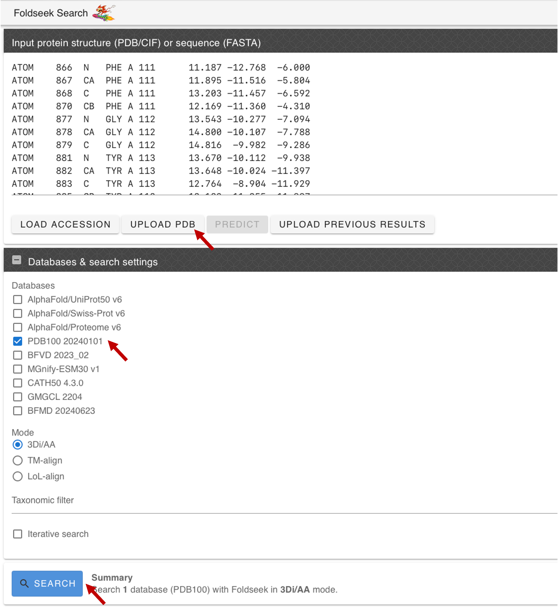

5. Evaluate the results and click on the best hit: the VgrG spike from the Type VI secretion system. You will be forwarded to the PDB page with the experimentally resolved structure.

    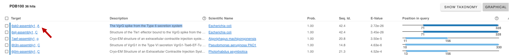

6. Open Mol\* and upload the best monomeric model. Upload the Foldseek hit (PDB ID: `6SK0`) structure using the **Download Structure** window in Mol\*.

    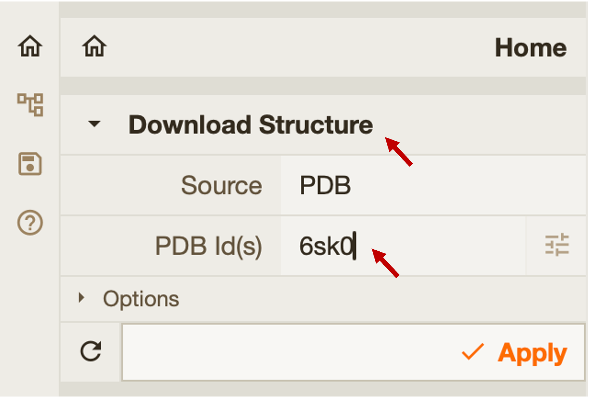{ width="60%" }

7. Superpose the AF2 model with the experimental structure. What do you observe?
8. Consider whether the modelled protein might be part of a **trimer** rather than a standalone monomer. To test this hypothesis, paste 3 copies of the target sequence into the input sequence field, separated by `:`, and run the prediction. This step takes approximately 1 hour; to save time, the results are also available in the [Data](data.md) section.
9. Evaluate the resulting plots and model. Superpose the predicted trimer with the experimental structure. Are there any notable differences in RMSD or TM-score?

!!! question "Questions to consider"
    - Do the confidence scores alone tell you whether the monomeric fold is biologically meaningful?
    - What conclusions can you draw from this exercise?

---

## Exercise 4.0: Alternative conformations

During their normal function, transporters like OCT1 go through a series of conformational changes. This means OCT1 does not have a single canonical structure, but rather several. OCT1 has been solved experimentally by cryo-EM in two conformations:

- Inward-open state (PDB ID: [8SC1](https://www.rcsb.org/structure/8SC1))
- Outward-open state (PDB ID: [8ET6](https://www.rcsb.org/structure/8ET6))

The structure files are available in the [Data](data.md) section (Exercise 4.0).

1. Open OCT1 on UniProt and copy the amino acid sequence.
2. Run ColabFold with the sequence you just copied.
3. Download the ground truth (experimental) structures in mmCIF or PDB format for both the inward-open state (8SC1) and outward-open state (8ET6).
4. Compare the structure you get from AlphaFold to both of them (RMSD). To which one is it closer?

---

## Exercise 4.1: MSA depth reduction or activating dropout layers

To sample different conformations (which is outside the initial scope of AlphaFold2) we have two strategies:

1. **Reducing MSA depth** through the `max_msa` parameter
2. **Activating dropout layers** by checking the `use_dropout` box

In both cases the result also depends on the starting point (seed), so we can increase the number of times the model is run (by setting `num_seeds` to a bigger number), thereby increasing the chance some of them are in an alternative conformation.

!!! note
    Running AlphaFold2 with more seeds (e.g. 16 instead of 1) produces more models (16×5 models instead of just 5), and takes much more time (16× longer). **To save time, we will skip this exercise** and try a different approach in the next exercise.

---

## Exercise 4.2: Using templates

OCT3 is a different membrane transporter from the same family, which has recently been determined in its outward state (PDB ID: [7ZH0](https://www.rcsb.org/structure/7ZH0)). We can provide this structure to try to bias the prediction of OCT1 towards the outward-open state.

The structure files (7ZH0 and 8ET6) are available in the [Data](data.md) section (Exercise 4.2).

1. Download the outward state of OCT3 (7ZH0) in mmCIF or PDB format.
2. In ColabFold, in the **Input protein sequence** section, change `template_mode` to `custom`. When running the cell, it will ask for the template file (7ZH0).
3. The MSA AlphaFold constructs for this protein is deep and rich in data, so it will use the MSA heavily and ignore the template. That is why we need to reduce the depth of the MSA — in one of two ways (option a is recommended):
    - **Option a — Reducing the MSA depth:** In the **Advanced settings** section, change `max_msa` to `16:32` or `32:64`.
    - **Option b — Completely removing the MSA:** In the **MSA options** section, change `msa_mode` to `single_sequence`.
4. Compare the structures you get now to the ground truth structures (8SC1 and 8ET6). Structures should be more similar to 8ET6.

---

## Exercise 5: Predict your favorite protein (bonus)

If you have completed all the exercises above, try applying ColabFold to a protein of your own choice.

!!! note
    Prediction of long proteins or large protein complexes may take considerable time (~1–2 hours).

1. Choose a protein and retrieve its sequence in FASTA format from UniProt.
2. Check if there is a model available in AFDB; if not, run a first prediction using the default ColabFold parameters.
3. Rerun the prediction using advanced options covered in the ColabFold lecture (slides available on the course website). Compare the two results: do the advanced settings improve pLDDT, PAE, or structural plausibility?
4. *(Optional)* If you are not satisfied with the default MSA, build a custom MSA using the [HHblits Toolkit server](https://toolkit.tuebingen.mpg.de/tools/hhblits), download it in A3M format, and use it as input for a third run.
5. *(Optional)* If you want to model different conformations, search for structural templates (e.g. using [Foldseek](https://search.foldseek.com/) or [Swiss-Model](https://swissmodel.expasy.org/)) and rerun the prediction with custom templates and reduced MSA depth.
