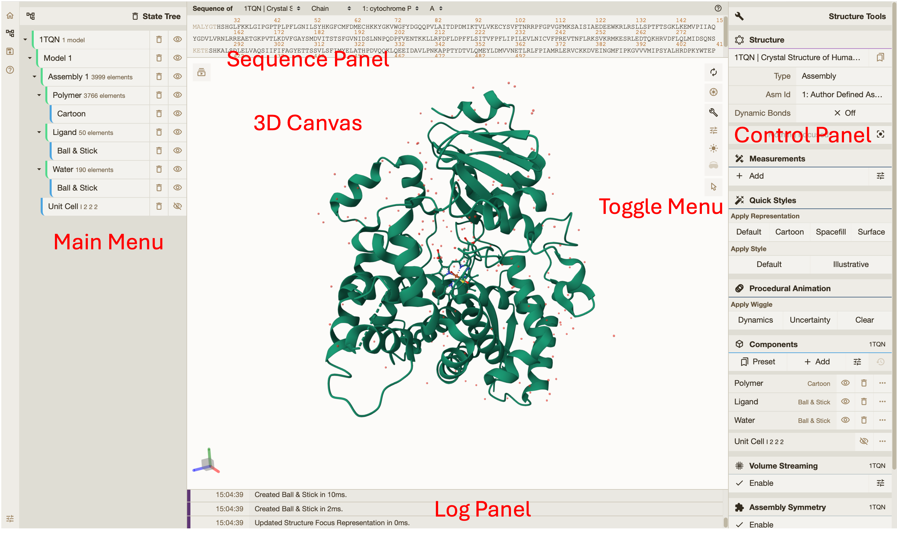
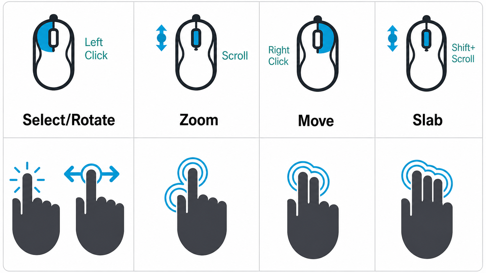
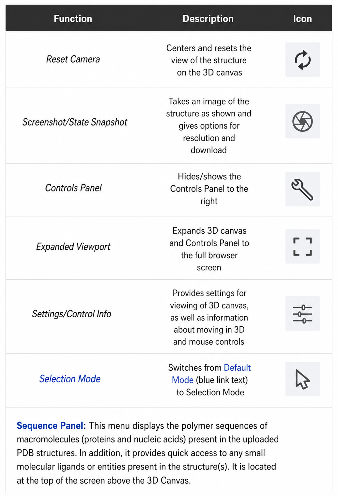
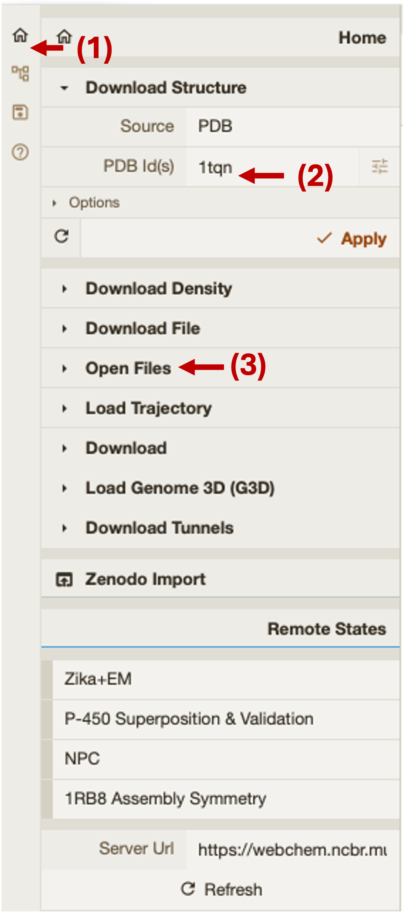

# Mol* Tutorial

!!! note
    This cheat sheet, with edits, is from the [complete Mol* documentation](https://molstar.org/viewer-docs/).

## General Interface

### Navigate the 3D Canvas

| Action | How to |
|--------|--------|
| **Rotate** | Left mouse button + drag, or Shift + left mouse button + drag |
| **Zoom** | Mouse wheel. On touchpad: two-finger drag. On touchscreen: pinch two fingers |
| **Move** | Right mouse button + drag, or Ctrl + left mouse button + drag. On touchscreen: two-finger drag |
| **Center and zoom** | Right mouse button click on the part of the structure you wish to see |
| **Change clipping planes** | Shift + mouse wheel. On touchpad: Shift + two-finger drag |

## Toggle Menu

  

Mol\* has two modes that change the behavior of a click. Switch between them using the **Selection Mode icon** (shaped like a cursor) in the Toggle Menu.

**Default Mode:** A click on a residue focuses on it. The focused residue and its surroundings are displayed in ball & stick representation with all local non-covalent interactions shown. Click again to hide surroundings.

**Selection Mode:** A click on a residue selects it. Selected parts appear with a bright green tint in the 3D canvas and Sequence Panel. Holding Shift while clicking extends the selection along the polymer from the last clicked residue.

## How To...

### Select

1. Open Selection Mode (cursor symbol in Toggle Menu)
2. Change the Picking Level if needed (residue/chain/etc)
3. Then either:
    - Click on objects in the 3D canvas, OR
    - Click on residues in the Sequence Panel, OR
    - Use the Set Operations Menu in the Selection Mode toolbar

### See or Hide

Create a component of the region you wish to see/hide → go to the **Components Panel** and press the **eye icon** next to the component you created.

### Color

!!! note
    Components are located in the Control Panel. If you want to set coloring for separate entities, create a component for each entity.

| Color scheme | Path |
|---|---|
| N→C terminus (rainbow) | Components → Polymer → Set Coloring → Residue Property → Sequence Id |
| pLDDT | Components → Polymer → Set Coloring → Validation → pLDDT |
| Heteroatom | Components → Polymer → Set Coloring → Atom Property → Element Symbol |
| Secondary structure | Components → Polymer → Set Coloring → Residue Property → Secondary Structure |
| Hydrophobicity | Components → Polymer → Set Coloring → Residue Property → Hydrophobicity |
| Domain | Select domain → Selections Menu → Apply Theme to Selection → Color → Apply Theme |

### Compare Structures

First, upload two or more structures at [rcsb.org/3D-view](https://rcsb.org/3D-view).

- **By chains** — Select 2 or more polymer chains/residues → Superposition → By Chains → Superpose (RMSD-based or TM-align)
- **By atoms** — Select 1 or more atoms → Superposition → By Atoms → Superpose

### Make Measurements

- **Distance** — Make 2+ selections → Measurements → Add → Distance
- **Angle** — Make 3+ selections → Measurements → Add → Angle
- **Dihedral** — Make 4+ selections → Measurements → Add → Dihedral

### Upload Structures

Go to the Home main menu. Options include:

- **Download from PDB** — paste a PDB ID
- **Open Files** — upload from your laptop

{ width="85%" }

---

## Exercise 1 (together)

Upload from PDB the crystal structure of human **myoglobin** (PDB ID: `1MBO`) and **hemoglobin** (PDB ID: `4HHB`).

Myoglobin is a monomer and hemoglobin is a tetramer. Select one chain of hemoglobin and one of myoglobin and superpose them using **TM-align**. Then hide all chains of hemoglobin that were not superposed with myoglobin.

## Exercise 2

Upload the best model for the **PIGU protein** from Exercise 1 of the ColabFold tutorial to Mol* and color it by **pLDDT**.

PIGU protein (UniProt ID: [Q9H490](https://www.uniprot.org/uniprotkb/Q9H490)) is part of the human glycosylphosphatidylinositol (GPI) transamidase complex.

Download from PDB the structure of **GPIT** (PDB ID: `7W72`) and superpose the modeled PIGU protein with PIGU in the complex.

- Analyze the **TM-score** and **RMSD** scores
- What can you say about the structural alignment?
- Hide all chains that were not superposed with PIGU
