# AlphaFold Server Tutorial + Boltz-2

---

## Exercise 1: Modeling of Calmodulin With and Without Ca²⁺ Ions

Upon Ca²⁺ binding, calmodulin undergoes conformational rearrangements. In this exercise, we want to model calmodulin in the apo conformation (without Ca²⁺ ions) and the Ca²⁺-bound conformation.

**Target:** Calmodulin from *H. sapiens* (UniProt ID: [P0DP23](https://www.uniprot.org/uniprotkb/P0DP23))

**Input sequence:** Copy the sequence from UniProt: [P0DP23](https://www.uniprot.org/uniprotkb/P0DP23)

1. First, model calmodulin in the **apo conformation**. Go to [AlphaFold Server](https://alphafoldserver.com/), select **Protein** as the Entity type, keep **Copies** as 1 (monomer) and insert the calmodulin sequence into the sequence field. Press **Continue** and preview the job.

    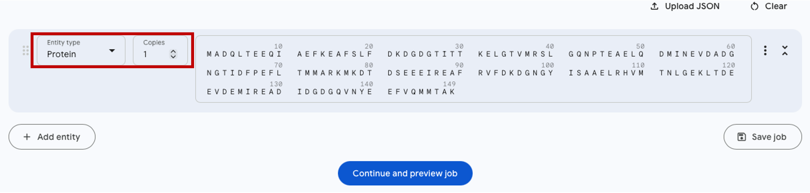

2. In the window, rename the Job name as "calmodulin" and press **Confirm and submit job**.

    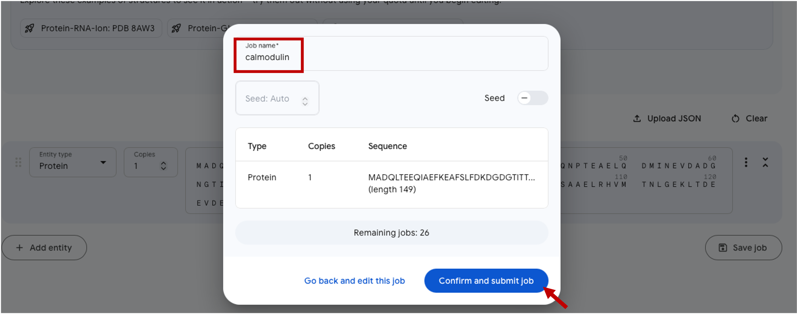

3. Model calmodulin in complex with **4 Ca²⁺ ions**. Press **+ Add entity** → Entity type **"Ion"** → Copies set to **4** and in the window select **Ca²⁺**.

    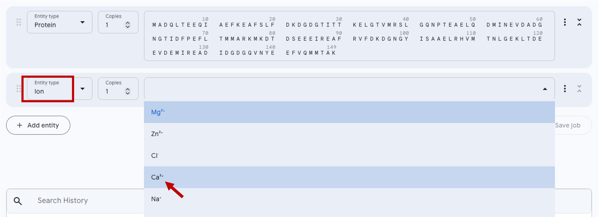

4. Click on the jobs and evaluate the results.

    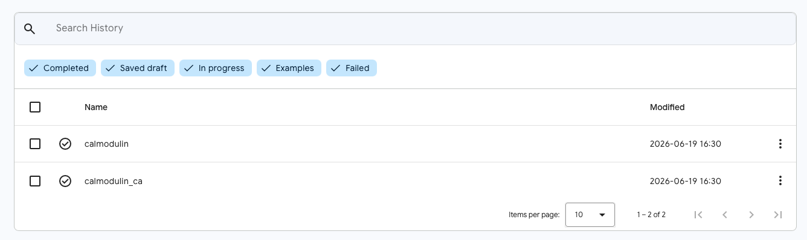

5. Download the models.

    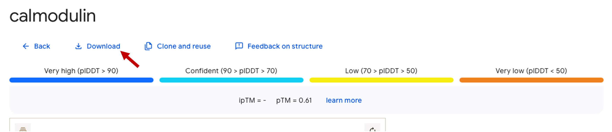

6. Now compare the apo and Ca²⁺-bound conformations in Mol\*. Upload the best model for each run and superpose them with TM-align. Do you see any differences?

7. Now confirm to which state (apo or Ca²⁺-bound) the resulting models correspond. Upload the apo (PDB ID: `1CFD`) and Ca²⁺-bound (PDB ID: `1CLL`) crystal structures of calmodulin from the PDB, and answer this question using TM-align.

---

## Exercise 2: Protein-ligand complex with Boltz-2

In this exercise, we will try modeling a protein-ligand complex using a model similar to AlphaFold3. In AlphaFold3, small molecule ligands can be specified either using:

- **SMILES string**
- **CCD code** of a ligand

Unfortunately, AlphaFold Server (the online implementation of AlphaFold3) does not support arbitrary SMILES input and only allows a very limited set of CCD ligands. To try out specifying a ligand with a SMILES string, we can use one of the online implementations of AlphaFold3-like models, such as [Boltz](https://boltz.bio/), [Chai-1](https://www.chaidiscovery.com/), and others.

We will use **Boltz-2** via [Neurosnap](https://neurosnap.ai/). Using it requires a free account (you get ~2 free predictions).

**Target:** Since we are having this course in Basel, we can model the binding of **LSD to the 5-HT2A receptor** (a serotonin receptor). LSD was first synthesized by Albert Hofmann in Basel, where he also famously discovered its effects.

**Experimental structure:** PDB [`7WC6`](https://www.rcsb.org/structure/7WC6)

**Protein sequence:** The FASTA file can be found in the [Data](data.md) section (Exercise 2).

**Ligand SMILES string:** `CCN(CC)C(=O)C1CN(C2Cc3c[nH]c4c3c(ccc4)C2=C1)C`

1. Open [Neurosnap](https://neurosnap.ai/) and make an account. You will get a confirmation email (also check your spam folder). Once activated, find **Boltz-2** on the service (or open it [directly](https://neurosnap.ai/service/Boltz2)). Give the job a name in the **Job Note** section.

    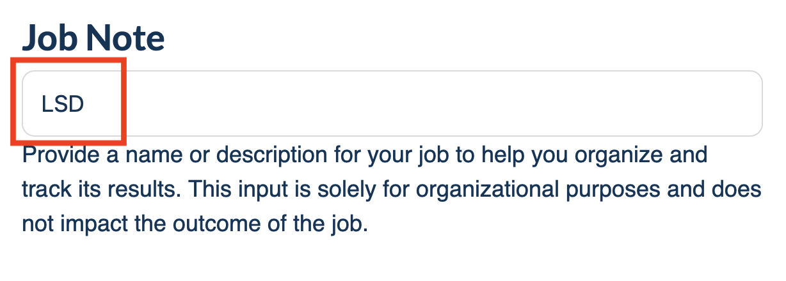

2. Get the protein sequence from the FASTA file, open the **Input Sequences** section and paste the protein sequence. Make sure the sequence is added before closing the window.

    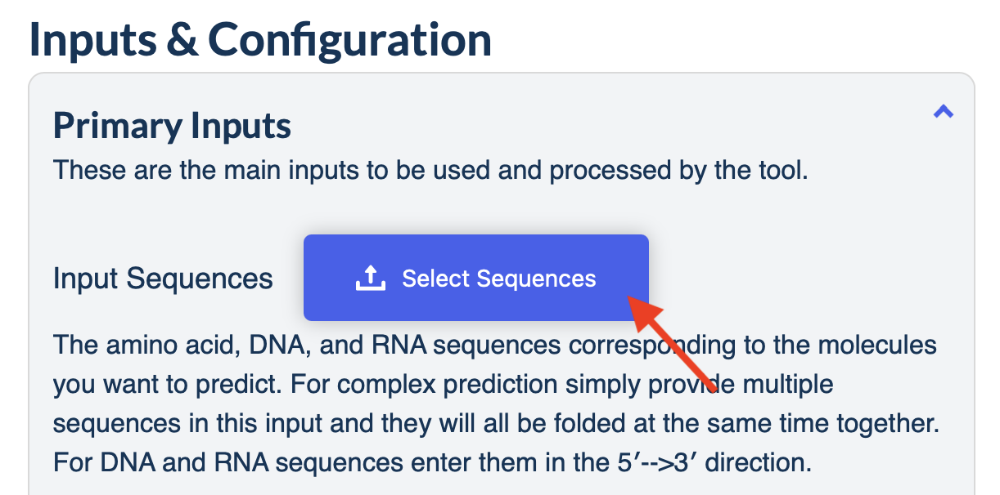

    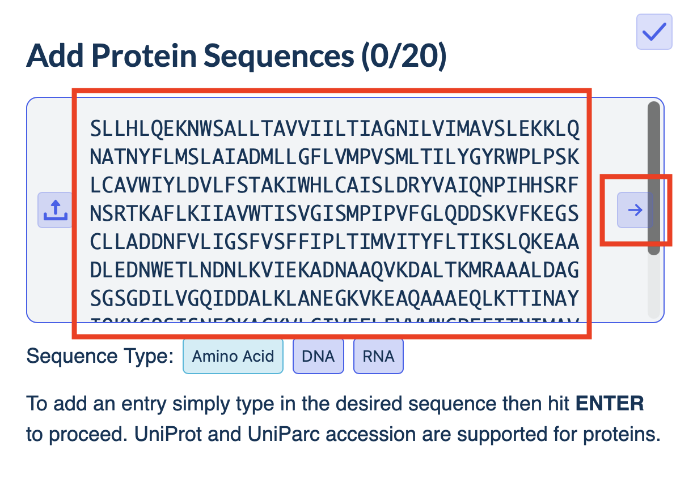

    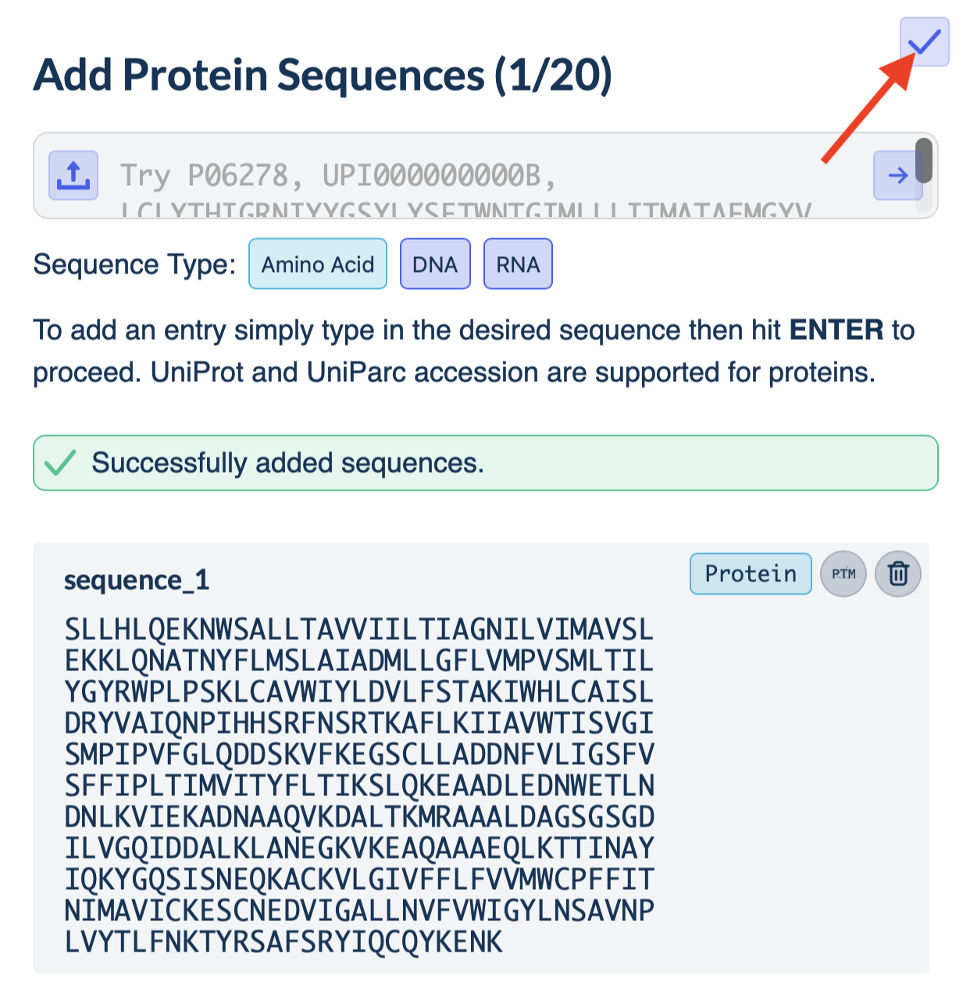

3. Copy the SMILES string of the ligand. Open the **Input Molecules** section, click on **Enter SMILES or CCD codes** and paste the SMILES string. Make sure the molecule is added before closing the window.

    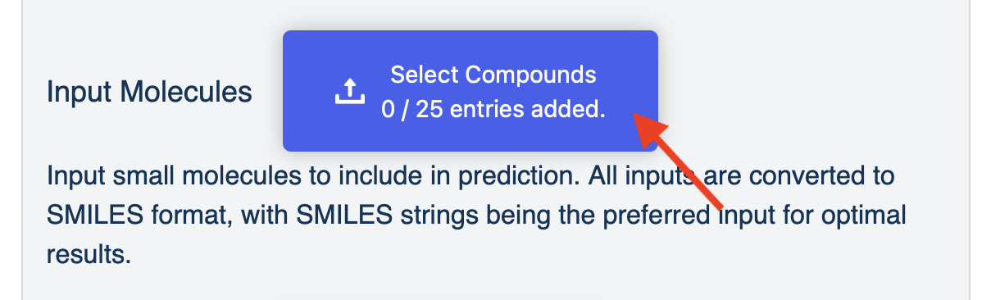

    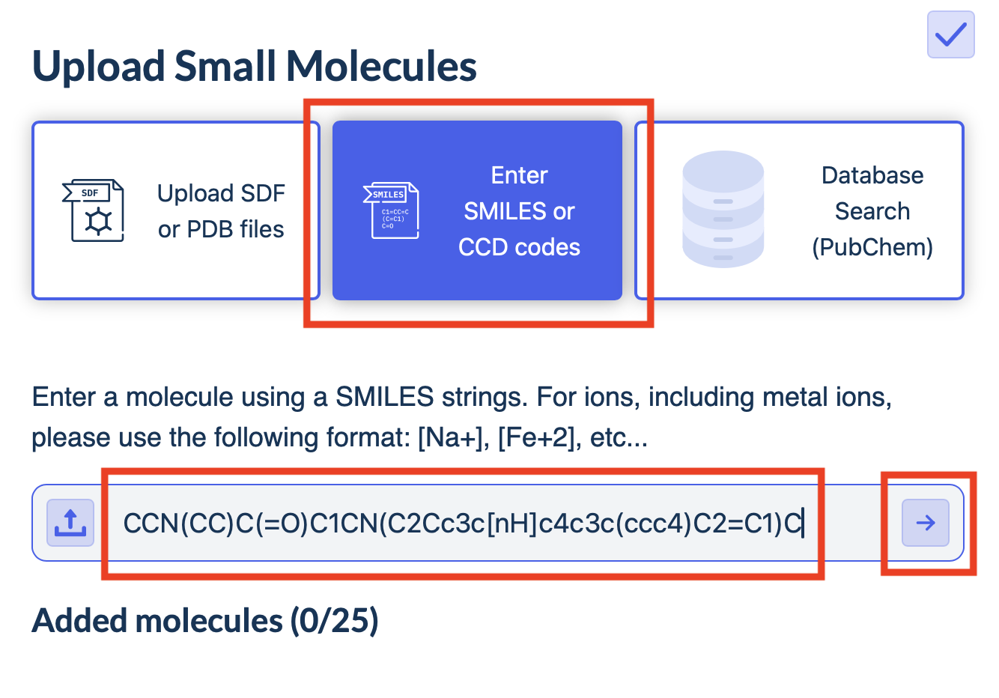

    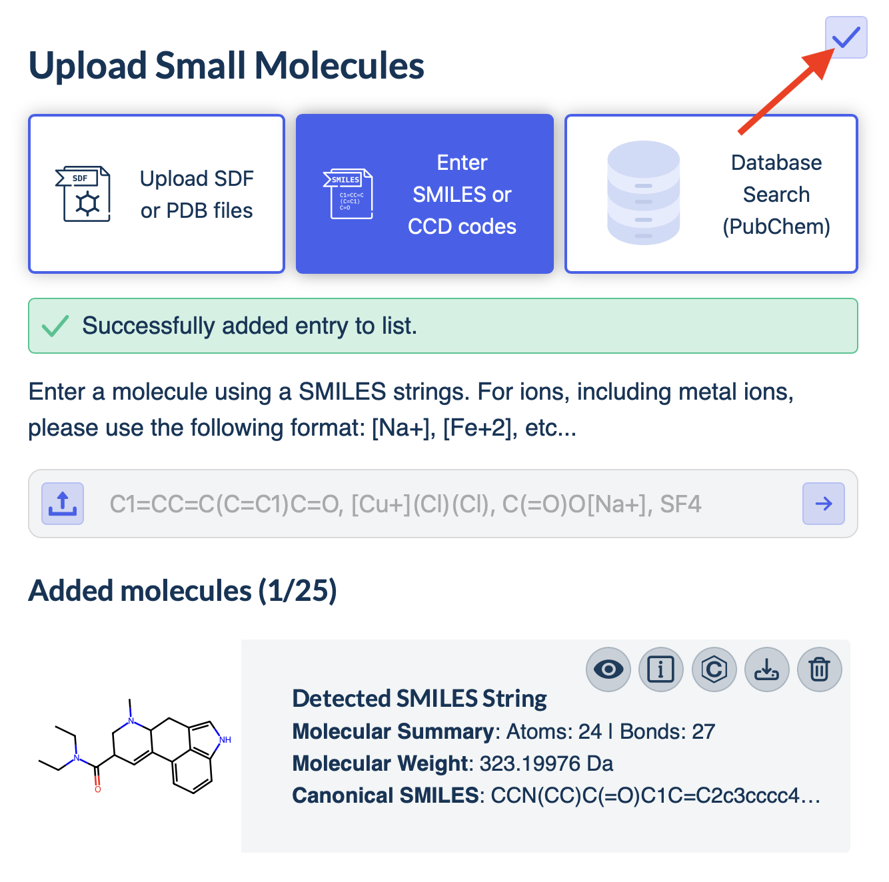

4. Click **Run Job** at the bottom of the page.

    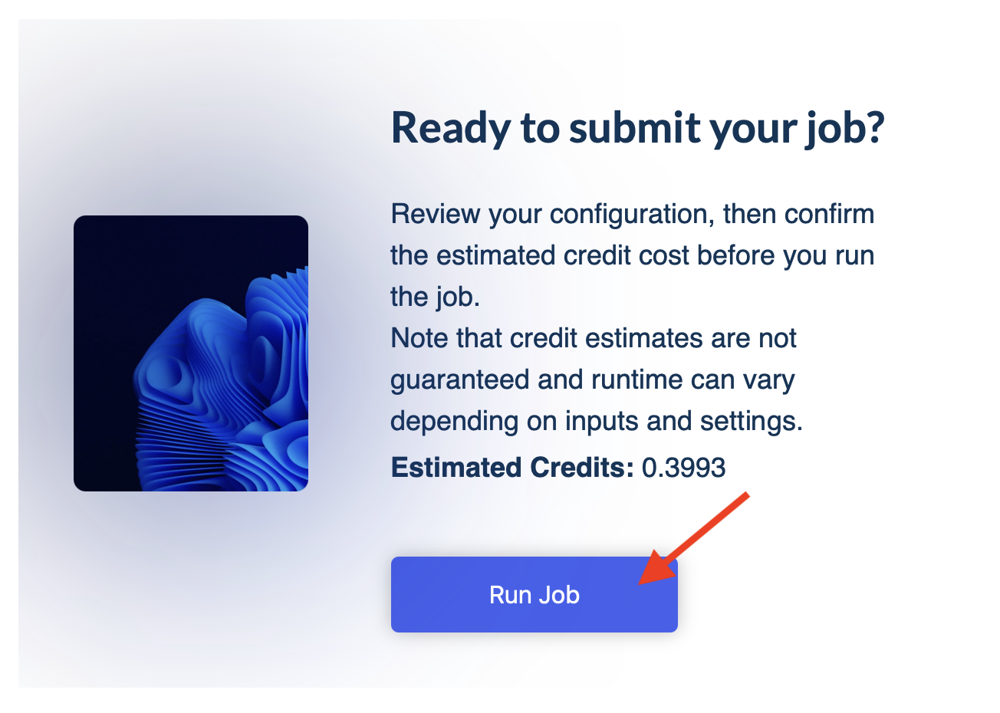

---

## Exercise 3: Predict your favorite protein

In this exercise, you can model a protein or protein complex of your own choice that you find biologically interesting.

!!! tip "Guidance"
    In case you don't have a target in mind, team up with someone who does!

- If you know the complex you want to model (including PTMs, ligands, DNA/RNA, etc.), submit the job on the [AlphaFold Server](https://alphafoldserver.com/) and analyze the resulting metrics. You can also use:
    - [LIVIA](https://livia.cs.tu-dortmund.de/) for additional scores (ipSAE, cLIS, etc.) and analysis of all models
    - [PAE Viewer](https://pae-viewer.uni-goettingen.de) for an interactive PAE matrix

- If you do **not** know the interacting partners (proteins, ligands, DNA/RNA, peptides), you can:
    - Use [SWISS-MODEL Repository](https://swissmodel.expasy.org/repository) for a sequence search for templates in PDB
    - Or/And generate a prediction for one or more chains and use it as a template (if prediction is confident) for a structural search using [Foldseek](https://search.foldseek.com/)
    - After gaining some information, proceed to the AlphaFold Server submission above
